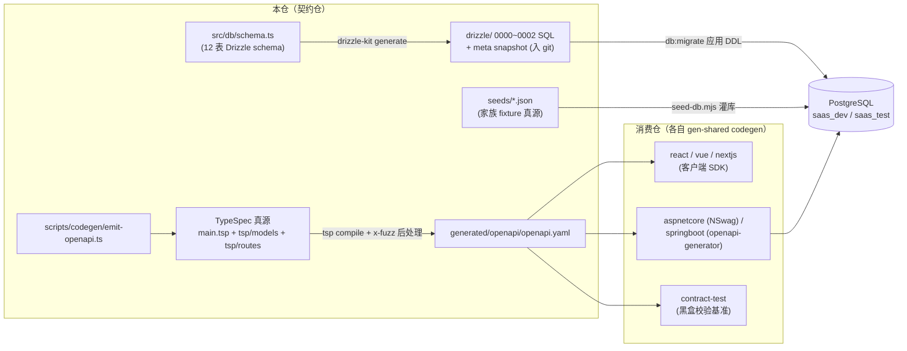
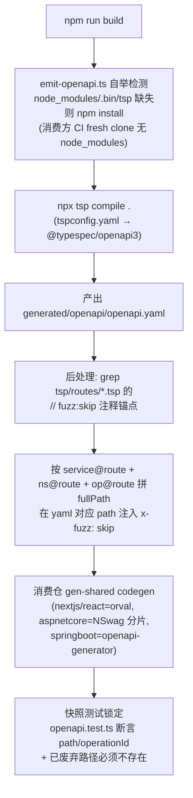

# saas-identity-platform-shared 架构

> 一句话定位：saas-identity-platform 多仓家族的**契约仓**（dual SSOT）——TypeSpec 定义 API 契约、Drizzle schema 定义 DB 结构，只产出语言无关中间产物（openapi.yaml / SQL 迁移），供 react / vue / nextjs / aspnetcore / springboot 各消费仓 gen-shared codegen。

生成日期：2026-09-22 ｜ 锚定 HEAD：62d305b ｜ 生成方式：DeepWiki 风格架构扫描

## 1. 总览

- **家族角色**：契约仓（shared BASE）。家族 6 角色中它是其余仓的共同上游：3 前端 + 2 后端各自从本仓的 `generated/openapi/openapi.yaml` 生成语言专属客户端/服务端骨架；contract-test 仓据同一契约做黑盒校验「前端不可区分」。
- **双 SSOT**：
  - API 契约真源 = `main.tsp` + `tsp/**/*.tsp`，经 `tsp compile` 产出 OpenAPI，**禁止手写 yaml**
  - DB schema 真源 = `src/db/schema.ts`（ADR-0025 schema-first），`drizzle/` 是 `drizzle-kit generate` 产物，**入 git、禁止手改**
- **技术栈**（钉死 `version-lock.json`）：TypeSpec compiler ^1.0.0 + @typespec/http ^1.15.0 + @typespec/openapi3 ^1.0.0；drizzle-orm ^0.36.4 + drizzle-kit ^0.28.1；TypeScript ^5.7.0 + Vitest ^2.1.0；Node >= 20。**禁止 npm runtime 依赖**（devDep 白名单见 CLAUDE.md，ADR-0025）。
- **规模速览**：契约面 28 个 path / 47 个 operationId / 43 个 schema（`generated/openapi/openapi.yaml`，2374 行）；DB 面 12 张表（`src/db/schema.ts`，367 行）、3 个已提交迁移；种子 7 张表的 fixture JSON；测试 4 个文件（~730 行）。
- **契约公共约定**（定义在 `main.tsp`）：统一错误 `ErrorResponse{code,message,details?}`；失败锁定 `LockedAccountResponse`（HTTP 423，含 `lockedUntil` 倒计时）；分页包裹 `Page<T>{items,page,pageSize,total}`（家族约定默认 `page=0/ps=20`）；创建类响应统一 `CreatedResponse{id:uuid}`。
- **遗留产物目录**：`generated/ts/dist/`（emit-openapi 与测试的旧编译缓存）与根目录 `saas_prod-backup-*.json`（1.4MB 生产快照备份）为历史遗留，非契约消费面。

## 2. 系统架构

关键边界：

1. 本仓**不含任何业务代码**——无 handler/service/controller，唯一可执行物是 build-time 脚本与测试。
2. 对外只暴露两个入口（`package.json#exports`）：`.` → `main.tsp`、`./openapi` → `generated/openapi/openapi.yaml`；禁止暴露语言专属路径。
3. DB 演进是单向管道：人只改 `src/db/schema.ts` → `db:generate` 落 `drizzle/` → `db:migrate` 应用到 PG；schema 与 snapshot 有 diff 即 gate 红（L4.db.idempotent）。
4. 契约与功能树是双账本：`tsp/routes/*.tsp` 必须与 `docs/functions/function-tree.md` 的 M/F/I 编号一一对应。
5. 语言专属产物下放：TS/Java/C# 客户端与服务器骨架由各消费仓 generate，本仓只产出语言无关的 OpenAPI 中间产物——消费仓单方面修改 shared 契约是家族禁令（ADR-0029），发现「本仓需要 ≠ shared」必须列候选方案停下问人。
6. 仓内两条铁律直接影响下游：`oauth_client.client_id` 是字符串 code 非 UUID（全家族寻址约定）；被 FK 引用的列必须 `unique()`（PG 42830 教训，commit `796a551`）。

## 3. 模块分解

| 模块/目录 | 职责 | 关键文件 |
| :--- | :--- | :--- |
| `main.tsp` | 契约入口：`@route("/api/v1")` + namespace `Saas.Identity.Shared`；公共模型 `ErrorResponse` / `LockedAccountResponse`（423）/ `Page<T>` / `CreatedResponse` | `main.tsp`（77 行，import 9 models + 11 routes） |
| `tsp/models/` | 9 个契约域模型：tenant、sys-user、sys-role、tenant-member、tenant-member-role、oauth-client、tenant-application、sys-menu、sys-role-menu | `tsp/models/*.tsp` |
| `tsp/routes/` | 11 组端点定义（另有 `_exempt.tsp`），按四个面组织（见下） | `tsp/routes/oauth.tsp`（authorize/token，token 带 `fuzz:skip` 注释锚点）、`tsp/routes/me.tsp`（whoami/switchTenant/getMyMenus） |
| `src/db/` | DB schema 真源（12 表：sys_users / tenants / tenant_members / oauth_clients / tenant_applications / oauth_codes / oauth_access_tokens / oauth_refresh_tokens / sys_menus / sys_roles / sys_role_menus / tenant_member_roles）+ 元数据 seed | `src/db/schema.ts`（367 行）、`src/db/seed.ts` |
| `drizzle/` | 迁移产物（入 git 禁手改）：`0000_target_ddl.sql` + `0001`/`0002` + `meta/_journal.json` + snapshot | `drizzle/0000_target_ddl.sql` |
| `scripts/` | build-time 工具：emit、migrate、rebaseline、seed、幂等检查 | `scripts/codegen/emit-openapi.ts`（115 行）、`scripts/seed-db.mjs`（379 行）、`scripts/check_drizzle_idempotent.py`（gate L4.db 用） |
| `seeds/` | 家族 fixture 真源（manifest v0.4.0）：tenant(3)/sys_user(5)/sys_role(4)/oauth_client(4)/sys_menu(41)/sys_role_menu(3)/tenant_member | `seeds/manifest.json` + 7 个表 JSON |
| `generated/openapi/` | 唯一对外契约产物 openapi.yaml（禁止手写） | `generated/openapi/openapi.yaml`（2374 行） |
| `tests/` | 契约锁定与 DB 回放测试 + fnReporter（4 文件，~730 行） | `tests/snapshots/openapi.test.ts`（95 行：断言 openapi 头、11 组目标路由组、已废弃 legacy path 不得残留）、`tests/drizzle.replay.test.ts`（298 行：空 public schema 回放 DDL 验租户/client/member 隔离图，真跑需 PG）、`tests/seed-db.test.ts`（198 行）、`tests/fnReporter.ts`（trace 上报，stack.json `trace_env` 需 `TRACE_MAP=1`） |

`tsp/routes/` 四个契约面：

- **全局身份面**：`sessions`（/auth/login、/auth/logout）、`me`（/me、/me/tenants、/me/tenants/{tenantId}/switch、/me/menus）
- **平台管理面**：`admin-tenants`（/admin/tenants）、`admin-clients`（/admin/clients，含 /status 状态变更端点——UpdateSysUserRequest 已删 status 字段，状态变更唯一通道）
- **租户运营面**：`tenant-members`（成员/邀请/角色/状态）、`tenant-roles`（角色 + /menus 授权）、`tenant-applications`（租户订阅的 app）
- **应用资源面**：`clients`（公开 client 信息）、`client-menus`（菜单 CRUD + parent/reorder）、`tenant-role-menus`、`oauth`（/oauth/authorize、/oauth/token）

## 4. 数据流 / 请求生命周期

契约仓最有代表性的是 **emit → codegen 流水线**（`npm run build` = `emit:openapi`）：

配套 DB 流：改 `src/db/schema.ts` → `npm run db:generate`（drizzle-kit generate 落 `drizzle/`）→ 同 commit 提交 → `npm run db:migrate`（`scripts/migrate-db.mjs` 按 `__drizzle_migrations` journal 应用）。种子灌库链：`scripts/seed-db.mjs` 读 `seeds/*.json`（manifest v0.4.0 声明来源与映射约定：msw fixture 旧模型 → 9/7 pivot 后 OAuth 中心模型，如 users→sys_user 全局自然人、apps→oauth_client 且 client_id 列存字符串 code 非 UUID），默认先 TRUNCATE 全业务表再按 FK 顺序全量重灌——saas 侧幂等契约是全量重灌而非 upsert（与 lab 侧 upsert 语义不同，勿混）；clientId 查不到对应 app 时 fail-safe skip（ADR-0019 业务身份列禁兜底字面量）。`scripts/rebaseline-db.mjs` 是一次性破坏性重建（DROP public schema，生产须 `NODE_ENV=production` + `PG_REBASELINE_ALLOW=1` 双闸）。

## 5. 依赖面

- **对下游消费仓**：单向供给——`generated/openapi/openapi.yaml`（`exports: "./openapi"`）。消费方 CI fresh clone 本仓但不 install，由 emit-openapi.ts 自举 `npm install`。本仓不依赖任何消费仓。
- **功能树账本**：`docs/functions/function-tree.md`（全体系唯一锚点，M/F/I 三级编号：功能模块/功能/功能子项，子项 = 权限点 = API 接口挂载点）；交付列（仅前端/仅后端/前端+后端）BASE 定标、5 仓镜像照抄（ADR-0024）。契约与功能树是双账本，改契约同 commit 挂 function-tree ID。
- **文档面**：`docs/`（ADR 索引、conventions 细则、design、plans、requirements；`docs/ARCHITECTURE.md` 是仓内旧版长文，根目录本文档为 deepwiki 重生成产物）。
- **外部依赖（真跑 L4.db 时）**：PostgreSQL（dev 默认 `100.79.128.25:5432`，`saas_dev`/`saas_test` 三库分层），连接走 PG_* 五件套或 `DATABASE_URL`。本仓无 Docker 镜像、无部署链——`.github/workflows/ci.yml` 是 test-only 门禁镜像（L1/L3/L4 + npmmirror registry），旧版误抄的 deploy 链已删。
- **放行方式**：全量回归绿后打 tag `v<MAJOR>.<MINOR>.<PATCH>-<YYYYMMDD>`（如 `v0.2.13-20260826`），tag 即放行；版本变更记 `CHANGELOG.md`，待办记 `PLAN.md`，依赖白名单锁 `version-lock.json`。
- **对外契约口径**：所有端点前缀 `/api/v1`（`main.tsp` service-level `@route`）；分页 `page` 从 0 起、`pageSize` 默认 20（contract-test 家族约定，Skip 系数按此对齐）；OAuth 采用 RFC 6749 路线 A（authorization_code + refresh_token 双 grant 合并在 `/oauth/token`，见 `tsp/routes/oauth.tsp` 注释）。

## 6. 配置与部署

- **env 三件套** `.env.example` / `.env.test` / `.env.production`：L0.5 门管理，key 集合严格相等；secret 由 deploy 侧注入，不 commit 真密钥。脚本侧一律 `requireEnv` fail-fast（缺失即 throw/exit，禁止默认值兜底，ADR-0019）。

| key | 用途 | 缺失时的行为 |
| :--- | :--- | :--- |
| `PG_HOST/PORT/USER/PASSWORD/DATABASE` | drizzle-kit 与 migrate/rebaseline/幂等检查连 PG | `requireEnv` throw；gate L4.db.idempotent 报 exit 2（CI 可 `CI_DRIZZLE_SKIP=1` 跳过） |
| `DATABASE_URL` | `seed-db.mjs` / `src/db/seed.ts` 连接串 | 打印错误并 exit 1（无兜底） |
| `SEED_OAUTH_CLIENT_ID` / `SEED_OAUTH_CLIENT_SECRET` | `src/db/seed.ts` 首个 first-party client | `requireEnv` throw |
| `JWT_SIGNING_KEY/ISSUER/AUDIENCE/TTL_SECONDS/REFRESH_TTL_SECONDS` | 全家族镜像的 JWT 参数（HS256 ≥32B） | 本仓不消费，模板内为家族对齐记录；消费仓侧 fail-fast |
| `PG_SSL=1` | drizzle 连接启用 ssl | 可选，默认不启用 |
| `PG_REBASELINE_ALLOW=1` | rebaseline 生产双闸之一 | 缺失时生产环境拒绝 DROP |
| `CI_DRIZZLE_SKIP=1` | CI 跳过 L4.db.idempotent | 可选（stack.json `skip_env`） |

- **端口**：无——纯契约仓不监听端口；DB 走 PG 5432。
- **构建产物**：`generated/openapi/openapi.yaml`（入 git）；`drizzle/*.sql`（入 git）。无 Dockerfile、无 VPS 部署。

## 7. 质量门禁

来自 `.harness/stack.json`（suite 根跑 `python scripts/gate.py -p saas-identity-platform-shared`）：

| 门 | 名称 | 命令 | 修复指引 |
| :--- | :--- | :--- | :--- |
| L1 | 格式 | `npx --no tsp compile . --no-emit` | 修复 tsp/main.tsp 语法 |
| L3 | 类型 | `npx --no tsc --noEmit` | 补全类型 |
| L4 | 测试 | `npx --no vitest run` | 先让测试变绿 |
| L4.db.idempotent | Drizzle schema 幂等 | `python scripts/check_drizzle_idempotent.py`（`CI_DRIZZLE_SKIP=1` 可跳） | schema.ts 与最新 snapshot 有 diff → `npm run db:generate` 落 `drizzle/` 并提交 |

trace 命令：`npx --no vitest run`，`trace_env` 需 `TRACE_MAP=1`。

exit code 语义：**0** = 通过；**1** = 按修复提示回代码；**2** = 契约/环境问题，停下问人。

日常工作循环（CLAUDE.md §6）：改 `tsp/` 或 `src/db/schema.ts` → `npm run build`（+ 改 schema 时 `db:generate`）→ gate exit 1 修、exit 2 停下问人 → `/handoff` 更新 `.state/session.json` → 全绿后按语义打 `v*` tag 放行。

补充硬约束（详见 CLAUDE.md）：被 FK 引用的列必须用 `unique()` 而非 `uniqueIndex()`（PG 42830）；`drizzle-kit check` 不验 DDL 可执行性，改 schema 后需 push 到空库兜底验证；`ARCHITECTURE.md` 是 deepwiki 生成产物，禁止手改，漂移只能重新生成收口。
