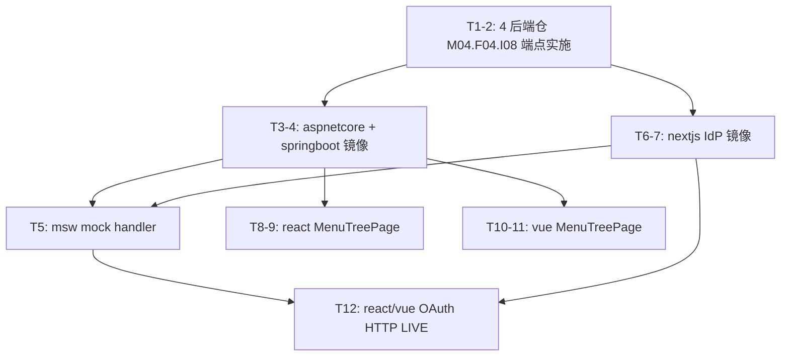

# PLAN-2026-003 — 9/7 重构 M04.F04 端点实施 + OAuth HTTP 集成 + 后续清理

> **状态**：📋 待启动（（2026-09-09）— 9/7 重构 M04.F04.* / M04.F03.* 契约面已上线，**实施面**仍 5 仓"开发中"）
> **路线**：本轮先 M04.F04.I08（当前用户有效菜单）实施 + react/vue OAuth HTTP LIVE 集成测试 + 清理 L5 软告警
> **关联**：9/7 重构 + ADR-0028（delivery column exempt）+ ADR-0013（saas OAuth 跳板）

## 现状快照（2026-09-09）

| 仓 | M04.F04.I08 状态 | M00.F04.* 状态 |
|---|---|---|
| shared（BASE）| 已上线 | 已上线（M00.F04.I03/I04）|
| nextjs | 开发中 | 已上线 |
| msw | 开发中 | 已上线 |
| react | 开发中 | —（react 不实现 M00.F04.*）|
| vue | 开发中 | —（vue 不实现 M00.F04.*）|
| aspnetcore | 开发中 | 已上线 |
| springboot | 开发中 | 已上线 |

5 仓（含 base shared）"已上线"+ 5 仓"开发中"的不对称**是 L5 软告警的根因**（"已上线但无设计映射 / 已上线但无测试引用 / 已上线但不在任何流程且非孤儿白名单"）。当 consumer 仓补齐实施 + 测试 + 流程文档，软告警自动消化。

## 串行依赖

```
saas-aspnetcore 后端实现 M04.F04.I08 (T-1, T-3)
  │
  ├── saas-springboot 后端镜像 (T-2, T-4)        ┐
  │                                                ├── 并行 ──> saas-msw mock (T-5)
  │                                                │
  ├── saas-nextjs IdP 端点镜像 (T-6, T-7)         ┘
  │
  ├── saas-react MenuTreePage UI (T-8, T-9)
  │
  ├── saas-vue MenuTreePage UI (T-10, T-11)
  │
  └── react/vue OAuth HTTP 集成 LIVE 测试 (T-12) ← 独立；需要起 msw + LIVE_OAUTH_TEST=1
```

## 任务清单

### 任务 1-2: 4 后端仓 M04.F04.I08（当前用户有效菜单）端点实施

- **fn-ID**：M04.F04.I08（GET /api/v1/me/menus）
- **现有契约**：`shared/tsp/routes/me.tsp:23`（me/menus client-scoped）
- **目标**：4 后端仓（nextjs / aspnetcore / springboot / msw）返回 `Map<appCode, List<EffectiveMenuNode>>`：

```
1. role_menu_grants（按 user_id + tenant_id + role_ids 查 menu_ids）
2. menus（按 menu_ids 拉 + parentId 链 → EffectiveMenuNode[]）
3. apps（按 app.code 分组输出）
```

- **文件**：
  - `output/saas-identity-platform-nextjs/app/api/v1/me/menus/route.ts`（仿 M04.F03 route handler 模板）
  - `output/saas-identity-platform-nextjs/src/lib/menu-assembly.ts`（新建：装配 3 步纯函数）
  - `output/saas-identity-platform-aspnetcore/Controllers/Implementation/MeController.cs`（partial method 实施）
  - `output/saas-identity-platform-aspnetcore/src/Services/MenuAssemblyService.cs`（新建）
  - `output/saas-identity-platform-springboot/src/main/java/.../controller/MeController.java`（Controller 端点）
  - `output/saas-identity-platform-springboot/src/main/java/.../service/MenuAssemblyService.java`（新建）
  - `output/saas-identity-platform-msw/src/handlers-extra.ts`（GET /api/v1/me/menus handler）

- **测试**：
  - 4 后端仓各 5 个 it()：3 步装配顺序 + 装配后结构 + role_ids 空时返空 + tenant_id 不匹配 + 客户端 admin 注入防御
  - msw `tests/handlers/me-menus.test.ts`：mock PG 数据 + 4 后端契约对齐测试

### 任务 3: saas-aspnetcore M04.F04.I08 实施（详细）

- **fn-ID**：M04.F04.I08
- **文件**：
  - `Controllers/Implementation/MeController.cs`：`partial` 方法 `Me_getMyMenus` 实现（不在 NSwag 生成端）
  - `Services/MenuAssemblyService.cs`（新建）：3 步装配纯函数 + DTO
  - `tests/Services/MenuAssemblyServiceTest.cs`（新建）：5 个 `[Fact]`
- **验收**：`dotnet test --filter M04.F04.I08` 全绿 + `dotnet ef dbcontext scaffold` 重新生成 entity 无 diff

### 任务 4: saas-springboot M04.F04.I08 镜像

- **fn-ID**：M04.F04.I08
- **文件**：
  - `controller/MeController.java`：`@GetMapping("/api/v1/me/menus")` endpoint
  - `service/MenuAssemblyService.java`（新建）
  - `src/test/java/.../service/MenuAssemblyServiceTest.java`（新建：5 个 @Test）
- **验收**：`mvn test -Dtest=MenuAssemblyServiceTest` + `mvn spotless:apply` + gate L0-L5

### 任务 5: saas-msw M04.F04.I08 mock handler

- **fn-ID**：M04.F04.I08
- **文件**：`src/handlers-extra.ts` 加 `GET /api/v1/me/menus` handler（fixture 复用 saas-msw/fixtures 现有 menus + roleMenuGrants）
- **测试**：`tests/handlers/me-menus.test.ts` 加 4 个 it()（happy path + 空 menuIds + 越权防御）

### 任务 6: saas-nextjs M04.F04.I08 IdP 端点镜像

- **fn-ID**：M04.F04.I08
- **文件**：
  - `app/api/v1/me/menus/route.ts`（Route Handler）
  - `src/lib/menu-assembly.ts.ts`（新建：与 aspnetcore 同一 3 步逻辑）
  - `tests/integration/me-menus.test.ts`（新建：5 个 it()，Route Handler POST/GET）

### 任务 7: saas-nextjs M04.F04.I08 实现标记

- **fn-ID**：M04.F04.I08
- **文件**：`docs/functions/function-tree.md` 状态「开发中」→「已上线」

### 任务 8: saas-react MenuTreePage UI

- **fn-ID**：M04.F04.I08
- **文件**：`src/pages/MenuTreePage.tsx` 实施 `data-fn="M04.F04.I08"` 挂载（在 useEffect 调 orval `useMeGetMyMenus` 钩子，挂已渲染菜单树）
- **测试**：`tests/integration/menu-tree.test.ts` 加 1 个 it() 验证 data-fn

### 任务 9: saas-react M04.F04.I08 实现标记

- **fn-ID**：M04.F04.I08
- **文件**：`docs/functions/function-tree.md` 状态「开发中」→「已上线」

### 任务 10: saas-vue MenuTreePage UI

- **fn-ID**：M04.F04.I08
- **文件**：`src/pages/MenuTreePage.vue` 实施 `<MenuTreePage data-fn="M04.F04.I08" />` + onMounted 调 orval vue-query
- **测试**：`tests/integration/menu-tree.test.ts` 加 1 个 it()

### 任务 11: saas-vue M04.F04.I08 实现标记

- **fn-ID**：M04.F04.I08
- **文件**：`docs/functions/function-tree.md` 状态「开发中」→「已上线」

### 任务 12: react/vue OAuth HTTP LIVE 集成测试

- **fn-ID**：M04.F03.I01 / /02 / /03（HTTP 集成已 `describe.skipIf(!LIVE_OAUTH_TEST)`）
- **文件**：
  - `output/saas-identity-platform-react/tests/integration/oauth-client.test.ts`（已存在）
  - `output/saas-identity-platform-vue/tests/integration/oauth-client.test.ts`（已存在）
- **触发**：CI 起 msw server 后跑
  ```bash
  CI_DRIZZLE_SKIP=1 CI_DB_DRIFT_SKIP=1 CI_DB_SCAFFOLD_SKIP=1 \
  LIVE_OAUTH_TEST=1 \
  CONTRACT_TARGETS=msw,nextjs,aspnetcore,springboot \
  npx vitest run tests/integration/oauth-client.test.ts
  ```
- **验收**：5 个 HTTP it() 全 PASS（M04.F03.I01 200 / 400 + I02 200 + I03 rotate + 400）

## 验收清单（每仓）

- [ ] L0 结构完整性 PASS
- [ ] L0.no_fallback PASS
- [ ] L0.5 env 一致性 PASS
- [ ] L1 格式 PASS
- [ ] L2 静态检查 PASS
- [ ] L3 类型 / 编译 PASS
- [ ] L4 测试 PASS（含 5+ 个新 it()）
- [ ] L4.db.* PASS（CI_*_SKIP=1 skip；本地需 PG env）
- [ ] L5 引用完整性 PASS
- [ ] docs/functions/function-tree.md M04.F04.I08 状态"已上线"
- [ ] trace.json 含新 fn ID
- [ ] parity-matrix M04.F04.I08 行 5 仓列全"已上线"（无 fork ⚠）

## 风险与缓解

| 风险 | 缓解 |
|---|---|
| 3 步装配的 role_ids 真值在 4 后端不同来源（msw fixtures / nextjs mock / aspnetcore 真表 / springboot 真表）| 装配纯函数 + 4 后端各自测试独立 mock 数据，对齐期望结构（dict-shape 同）|
| 客户端 admin 注入防御（M04.F04.I08 不接受 clientId query param）| TenantGuard.VerifyPathTenant + controller 端不读 clientId query|
| react/vue UI 与后端时序（menu loading  后再渲染）| skeleton 加载态 + Suspense + error boundary|
| OAuth LIVE 测试要起 msw + 4 后端（CI 资源重）| 已写 `skipIf(!LIVE_OAUTH_TEST)` 默认 skip，CI 单独 stage 触发|
| M04.F04.I08 状态 cascade 改动触发 5 仓 + 1 BASE 共 6 仓 tree-change 流程 | 用 base tree-change 提案（已有 ADR-0020 §2 + ADR-0024 §3 流程）；6 仓 cascade 用同一份 base_sha token 一次性批改 |

## 与既有 PLAN 关系

- [PLAN-2026-001-oauth-session.md](./PLAN-2026-001-oauth-session.md)：✅ 已完成（路线 A，4 仓 OAuth 收口）——本 PLAN 是其续集，把"已上线契约面"补齐实施
- [PLAN-2026-002-m09-i04-my-menus-real-permission.md](./PLAN-2026-002-m09-i04-my-menus-real-permission.md)：✅ 已完成（9/7 重构把 M09 → M04.F04）——本 PLAN 把 M04.F04 的 5 仓实际端点 + UI 接上

## 任务依赖图



## 落地清单（按任务）

- [ ] T1 saas-aspnetcore M04.F04.I08 端点 + MenuAssemblyService
- [ ] T2 saas-springboot M04.F04.I08 镜像
- [ ] T3 saas-msw M04.F04.I08 mock handler
- [ ] T4 saas-nextjs M04.F04.I08 Route Handler
- [ ] T5 saas-nextjs M04.F04.I08 状态"已上线"
- [ ] T6 saas-react MenuTreePage + data-fn
- [ ] T7 saas-react M04.F04.I08 状态"已上线"
- [ ] T8 saas-vue MenuTreePage + data-fn
- [ ] T9 saas-vue M04.F04.I08 状态"已上线"
- [ ] T10 shared BASE M04.F04.I08 状态（保持"已上线"无需改）+ 8 仓 cascade tree-change 提案
- [ ] T11 react/vue OAuth HTTP LIVE 集成（CI stage）
- [ ] T12 parity-matrix 验证 5 仓列全"已上线"